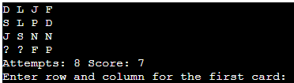

# Py Memory game

*The link to [Py Memory game](https://py-memory-game-05854a12957d.herokuapp.com/)*

---

## Introduction 

This is a simple memory game implemented in Python. The objective of the game is to find pairs of cards with matching letters by revealing them one at a time. The game continues until all pairs are found, and your goal is to complete it with as few attempts as possible. 

## How to Play 
1. Run the Python script to start the game.
   
2. Follow the on-screen instructions to reveal pairs of cards.
4. Enter the row and column numbers of the card you want to reveal (e.g., "1 2").
   
5. The game will inform you if the selected cards match or not.
   
   
6. Continue playing until all pairs are found and the game ends.
7. Your score will be displayed, indicating the number of attempts it took to complete the game.
   

# Features

* Random card shuffel.
* The  cards shuffle each time the game starts, so the user needs to remember the cards.
* Play a game that test your memory.
* Accepts user input.
* Input validation and error-checking:
   * You can only use the lines and columns provided.
   * You must enter two numbers with space between them from 0-3.
   * You can´t enter the same guess twice.
* The terminal cleans up everytime you beat the game.

## Future features

* Add input for the users name.
* Add design and images. 

# Data Model

The data model consists of a game board represented as a 2D grid, symbols are used to create card pairs, game state variables, functions for displaying the game board, and a main loop that orchestrates the gameplay. The code is organized to provide a playable memory game with clear instructions and keep scores for the player.

# Testing

I have manuallly tested this project by doing the folllowing:
   * The code was passed through a PEP8 linter and confirmed that there was no problem.
   * Tested in my local terminal and the Code Institute Heroku terminal.

# Bugs

## Solved bugs:

   * I accidentally created two variables with the same name. I corrected that while reading through my code.

   * The first time I tried to play py memory, the game did not appear on Heroku. Earlier I used a command in the 
   terminal, that filled up my requirements document. I realized that I did not need anything in that file, so 
   the text was deleted and the code functioning.

## Remaining bugs
   * No bugs remaining.

## Validator 

*PEP8 test from https://www.pythonchecker.com/, no errors found.

# Deployment

This project was deployed using Code Institute's mock terminal for Heroku.

## * Steps for deployment:
      * Fork or clone this repository
      * Create a new Heroku app
      * Set the buildbacks to Python and NodeJS in that order
      * Link the Heroku app to the repository
      * Click on 'Deploy'

# Credits

* Code Institute for inspiration to my README.md file.
* To my mentor Julia who helps me a lot and explains very well.
* To my friend Pierre for talking python code with me.
* To my partner who helps me keep on going, he´s my rock.
